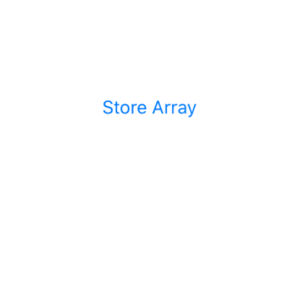

# Kicktest

Deploying Stellar Blockchain on iOS.  
*This app is created as a companion app for passing tic-tac-toe score as memo of a Stellar transaction from a Rasberry-Pi machine.*

## Installation

### CocoaPods

CocoaPods is a dependency manager for Cocoa projects. You can install it with the following command:

```bash
$ gem install cocoapods
```

### Stellar-ios-mac-sdk

Stellar-ios-mac-sdk Documentation can be found here [stellar-ios-mac-sdk docs](https://github.com/Soneso/stellar-ios-mac-sdk).

To integrate stellar SDK into your Xcode project using CocoaPods, specify it in your `Podfile`:

```ruby
use_frameworks!

target '<Your Target Name>' do
    pod 'stellar-ios-mac-sdk', '~> 1.6.4'
end
```

Then, run the following command:

```bash
$ pod repo update
$ pod install
```

This will install the dependencies listed in the Podfile.

## Usage

Contributions to be made in the kickTicTacToe.xcodeproj file


**Random Generation of Sender Account**
```swift
 let keyPair = try! KeyPair.generateRandomKeyPair()
        
        print("Account Id: " + keyPair.accountId)
        // GCFXHS4GXL6BVUCXBWXGTITROWLVYXQKQLF4YH5O5JT3YZXCYPAFBJZB
        
        print("Secret Seed: " + keyPair.secretSeed)
        // SAV76USXIJOBMEQXPANUOQM6F5LIOTLPDIDVRJBFFE2MDJXG24TAPUU7
```

**Create testnet account for sender**

```swift
sdk.accounts.createTestAccount(accountId: keyPair.accountId) { (response) -> (Void) in
            switch response {
            case .success(let details):
                DispatchQueue.main.async {
                    
                    self.label1.text = "Account 1 created"
                    
                }
                print(details)
                
            case .failure(let error):
                StellarSDKLog.printHorizonRequestErrorMessage(tag:"Error:", horizonRequestError: error)
            }
        }
```

**Random Generation of Destination Account**
```swift    
let keyPair2 = try! KeyPair.generateRandomKeyPair()

print("Account Id: " + keyPair2.accountId)
// GCWODM5VN44LFRFSWLEU7TOAD366BBRT4UMUCV4KDZWQC3DKJAFI5BN6

print("Secret Seed: " + keyPair2.secretSeed)
// SD42ITDCOSG6N6SFKU4DYSUSDB7CTU5CE3WYRKSY45Y7CLRUHBECWNV5
```

**Create testnet account for receiver**

```swift
sdk.accounts.createTestAccount(accountId: keyPair2.accountId) { (response) -> (Void) in
            switch response {
            case .success(let details):
                DispatchQueue.main.async {
                    
                    self.label2.text = "Account 2 created"
                    
                }
                print(details)
                
            case .failure(let error):
                StellarSDKLog.printHorizonRequestErrorMessage(tag:"Error:", horizonRequestError: error)
            }
        }
```

**Click Store Array to transfer memo on the Stellar Blockchain**



## Contributing
Pull requests are welcome. For major changes, please open an issue first to discuss what you would like to change.
Please make sure to update tests as appropriate.   

:heart:


